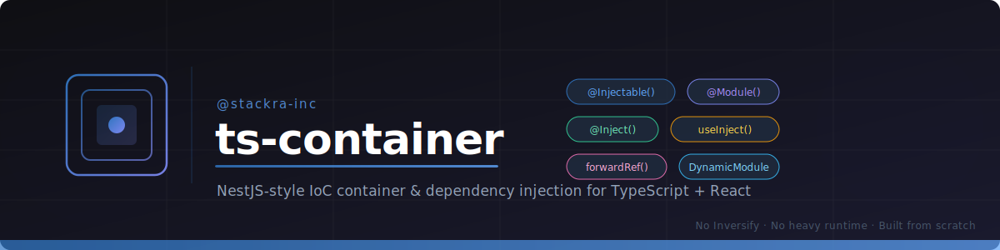

<div align="center">
  
</div>

<div align="center">

[](https://www.npmjs.com/package/@stackra-inc/ts-container)
[](../../LICENSE)
[](https://www.typescriptlang.org/)
[](https://react.dev/)

</div>

---

# React Integration

Demonstrates React bindings: `ContainerProvider`, `useInject`,
`useOptionalInject`, and `useContainer` hooks for accessing DI services inside
React components.

## What's Covered

- Bootstrapping the DI container and passing it to React via
  `<ContainerProvider>`
- `useInject()` to resolve services in components
- `useOptionalInject()` for optional/missing providers
- `useContainer()` for direct container access (`has()`, `get()`)
- Composing multiple services in a component tree

## Setup

This example is a conceptual React app. To run it, integrate the files into a
React project (Vite, Next.js, CRA, etc.) with these dependencies:

```bash
pnpm add react react-dom @stackra-inc/ts-container reflect-metadata
```

Then use `main.tsx` as your entry point.

## Files

| File             | Description                                                |
| ---------------- | ---------------------------------------------------------- |
| `main.tsx`       | App entry — bootstraps DI and mounts React                 |
| `services.ts`    | DI services and module definition                          |
| `components.tsx` | React components using `useInject` and `useOptionalInject` |

---

## Related Examples

- [Basic DI](../basic-di) — decorators, provider types, lifecycle hooks
- [Dynamic Modules](../dynamic-modules) — `forRoot()`, `@Global`, `forwardRef`

---

## License

MIT © [Stackra](https://github.com/stackra-inc)
